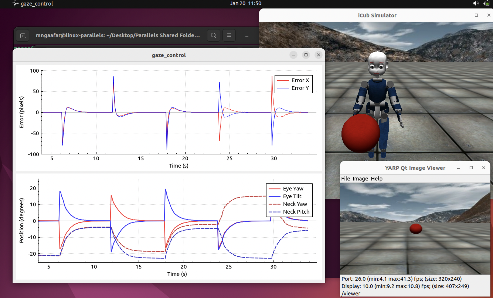
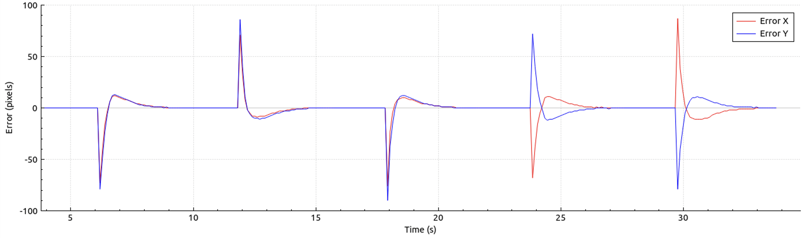
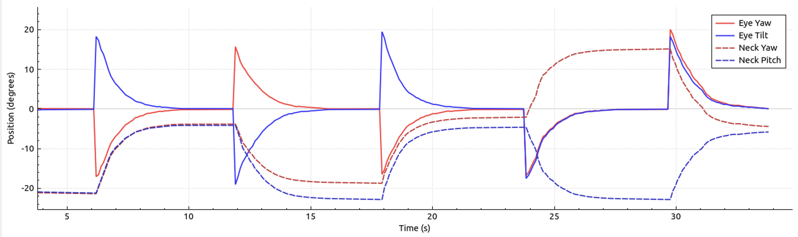

# iCub Eye Tracking System

## Author
Mohamed Nasser Gaafer  
Robotics Programming and IoT Course  
BioRobotics Institute, Scuola Superiore Sant'Anna, Pisa  
Course Instructors: Egidio Falotico, Ugo Albanese, Gastone Ciuti

## Abstract


This project implements a biologically-inspired gaze control system for the iCub humanoid robot. The system employs a hierarchical control architecture that combines smooth pursuit eye movements with coordinated head motion to achieve natural-looking gaze behavior. The implementation demonstrates fundamental concepts in robotic vision and bio-inspired control systems, with particular emphasis on real-time performance and stability.



## System Architecture

The system operates in three stages:

1. **Visual Processing**
   - Camera input processing (320x240 resolution)
   - Red object detection using RGB thresholding
   - Target position calculation via centroid

2. **Control System**
   - PID-based eye control
   - Velocity-based head control
   - Coordinated eye-head movement

3. **Motor Interface**
   - 50Hz control loop (20ms period)
   - Position control for eyes
   - Velocity control for neck


## Control System Design

### Eye Control

The eye movement uses a PID controller with the following parameters:

$$
\begin{aligned}
u(t) &= K_p e(t) + K_i \int e(t)dt + K_d \dot{e}(t) \\
\text{where: } K_p &= 0.2, \quad K_i = 0.01, \quad K_d = 0.05
\end{aligned}
$$

Key features:
- Error calculated in image coordinates (pixels)
- Integral windup prevention (±10.0 limit)
- Output in motor degrees

### Head Control

Head movement follows eye position using:

$$
v_{neck} = -1.2 \cdot \theta_{eye}
$$

Where:
- $v_{neck}$ is neck velocity
- $\theta_{eye}$ is eye deviation from center
- Movement starts when eyes deviate > 0.1°

## Implementation Details

### Prerequisites
- Ubuntu 22.04 (Jammy)
- YARP 3.7
- iCub Main 1.25.0

### Core Components

1. **Visual Processing**
   - RGB thresholding with conditions:
     $$
     \begin{cases}
     R > 2G \\
     R > 2B
     \end{cases}
     $$
   - Minimum 50 pixels required for tracking

2. **Control Loop**
   - 20ms cycle time (50Hz)
   - Synchronized eye-head motion
   - Smooth velocity transitions

## Results

### Visual Tracking Performance

The system demonstrates robust tracking capabilities across various conditions:


### Real-time Performance Plots

Real-time visualization of tracking errors and motor positions:




## Future Development

The system can be extended through:
- Integration with deep learning-based object detection
- Adaptive control for improved tracking performance
- Predictive motion estimation

## Building and Running

The project includes convenience scripts for common operations:

1. First-time setup and building:
```bash
./rebuild.sh
```

2. Running the system:
```bash
./run.sh
```

3. Shutting down all components:
```bash
./shutdown.sh
```

## Useful References

1. Pattacini, U., et al. (2010). An experimental evaluation of a novel minimum-jerk cartesian controller for humanoid robots. IEEE/RSJ International Conference on Intelligent Robots and Systems.

2. Roncone, A., et al. (2016). Gaze stabilization for humanoid robots: A comprehensive framework. IEEE-RAS International Conference on Humanoid Robots.
